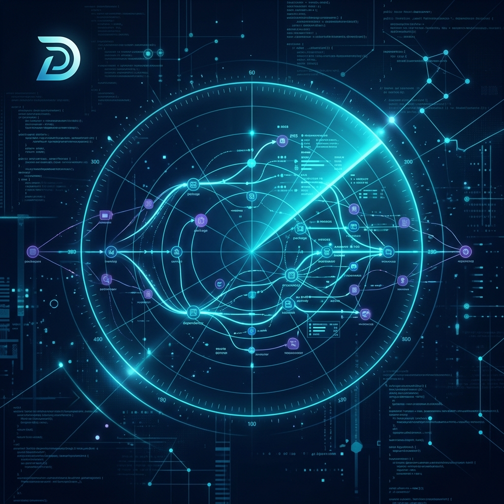
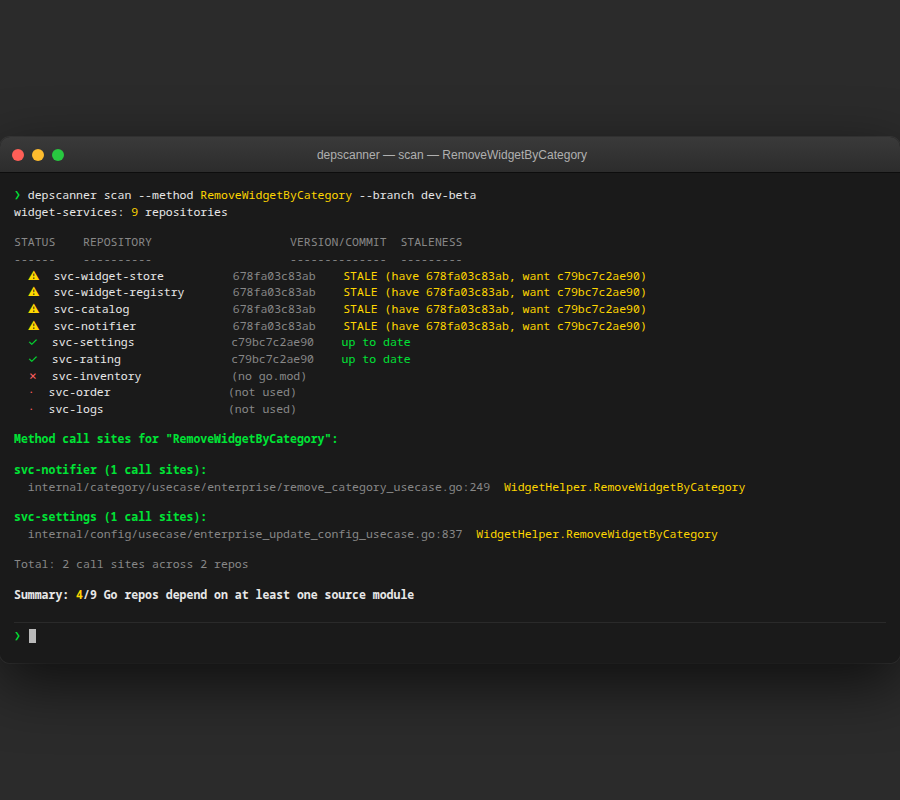
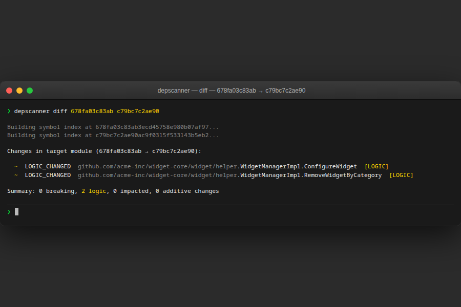
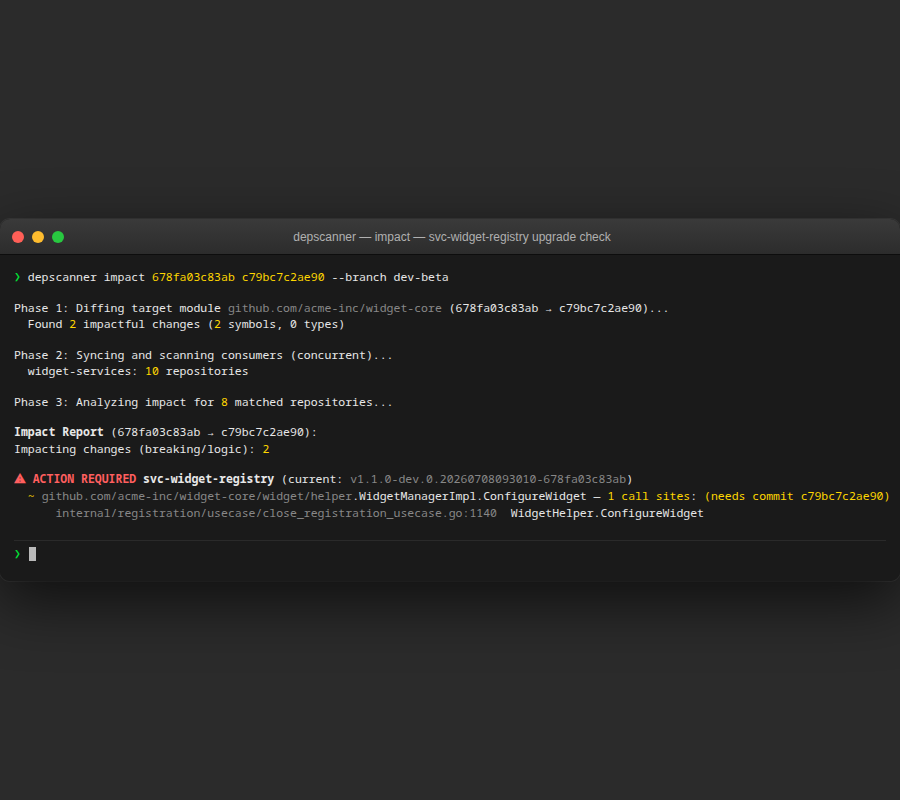
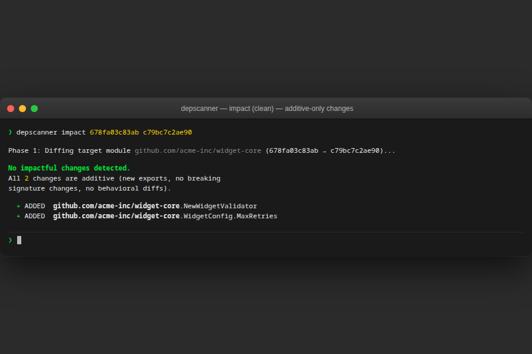
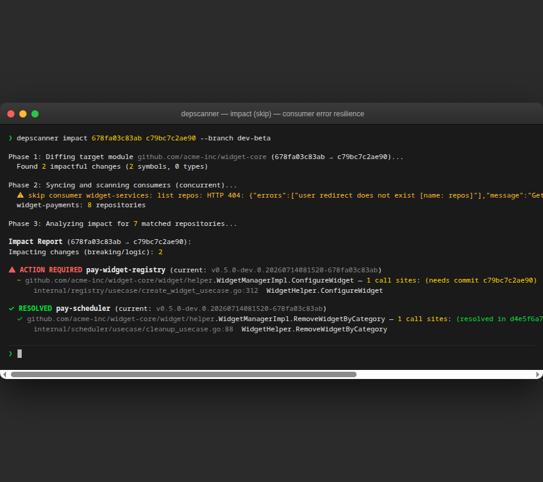

# depscanner



[](https://go.dev)
[](LICENSE)
[](#)
[](#testing)

A high-performance CLI tool designed for large-scale Go organizations to manage shared library dependencies. depscanner analyzes impact, tracks architectural debt, and validates API compatibility across hundreds of repositories.

## Key Features

- **Deep AST Analysis**: True function-level call-site tracking using Go's Abstract Syntax Tree. Understands package aliases and method calls (`obj.Method()`).
- **High-Performance Pipeline**: Concurrently syncs and processes multiple repositories using a worker-pool architecture.
- **Surgical Resolution Tracking**: Identifies if a fix has been applied by tracing symbol history through git log -L and ancestry checks.
- **Impact Analysis**: Automatically cross-references API breaking changes with actual call sites in consumer applications.
- **Transparent Reporting**: Displays how functions are actually called in code (e.g., `util.ProcessData`) for intuitive debugging.
- **Gitea Native**: Full integration with Gitea organization APIs.
- **Behavioral Audit**: Detects logic changes even when function signatures remain identical using SHA-256 body hashing.

## Prerequisites

- **Go 1.22+** and **git**
- **Gitea** instance with API token (org read + repo read access)
- Source module hosted on that Gitea (or local path)

<details>
<summary>Where to find your Gitea token</summary>

1. Log into your Gitea instance
2. Settings → Applications → Manage Access Tokens
3. Generate a token with `read:repository` and `read:organization` scopes
4. Set as env var: `export GITEA_TOKEN="your_token_here"`
</details>

## Install

```bash
go install github.com/mystaline/depscanner/cmd/depscanner@latest
```

Or clone and build:

```bash
git clone https://github.com/mystaline/depscanner.git
cd depscanner
make build        # outputs bin/depscanner
sudo mv bin/depscanner /usr/local/bin/   # Linux/macOS
```

Works on **Linux**, **macOS**, **Windows** (native and WSL2).

## Quickstart

```bash
# 1. Generate scaffold config in your project dir
depscanner init

# 2. Edit depscanner.yaml — set Gitea URL, token, org, and source module

# 3. Scan consumer repos for usage of your source module
depscanner scan

# 4. See who's stale
depscanner scan --branch dev

# 5. Compare API between two refs of your source module
depscanner diff a1b2c3d4 e5f6a7b8

# 6. Check which consumers are impacted by those changes
depscanner impact a1b2c3d4 e5f6a7b8
```

## Configuration

Generate a scaffold config in your project directory:

```bash
cd ~/Workspace/my-project
depscanner init  # writes depscanner.yaml
```

Or place at `$HOME/.depscanner.yaml` for a global default shared across projects.

```yaml
# ── SOURCES ─────────────────────────────────────────────────────
# The shared library ("source of truth") you want to track.
# Depscanner diffs this repo's API and scans consumers for usage.
sources:
  # url:    Your Gitea instance URL (e.g. "https://gitea.example.com")
  # token:  Gitea API token — use ${GITEA_TOKEN} env var, don't paste raw
  # org:    Gitea organization that owns this repo
  # repo:   Exact repo name inside that org (not URL, just name like "my-lib")
  - gitea: { url: "https://gitea.example.com", token: "${GITEA_TOKEN}", org: "my-org", repo: "my-lib" }

    # module: Optional. Full Go module path (e.g. "gitea.example.com/my-org/my-lib").
    #         Depscanner auto-reads this from the repo's go.mod when omitted.
    #         Set it only if the go.mod path differs from the default.
    # module: "gitea.example.com/my-org/my-lib"

    # flat_cache: Optional. Overrides cache layout for this provider.
    #             Default: repos stored under <cache_dir>/<org>/<repo>.
    #             When set, repos go directly under <flat_cache>/<repo>
    #             (no org subdirectory). Useful when multiple providers
    #             share a flat repo directory. Path/git providers ignore.
    # flat_cache: "/shared/cache/repos"

  # Add more sources if you track multiple independent libraries.
  # - gitea: { url: ..., token: ${GITEA_TOKEN}, org: another-org, repo: lib_two }

# ── CONSUMERS ───────────────────────────────────────────────────
# The services/applications that might import your source library.
# Depscanner scans every repo in these orgs for dependency usage.
consumers:
  # Same fields as source (url, token, org).
  # include_repos: Optional. Only scan these repos (whitelist). Supports glob.
  # exclude_repos: Optional. Skip these repos (denylist). Supports glob.
  #                When both set, exclude wins if a repo matches both.
  - gitea: { url: "https://gitea.example.com", token: "${GITEA_TOKEN}", org: "my-org", include_repos: ["svc-*"] }

    # flat_cache: Same as source — see above.
    # flat_cache: "/shared/cache/repos"

  # Consumers can span different orgs or be local paths:
  # - gitea: { url: ..., token: ${GITEA_TOKEN}, org: partner-org, exclude_repos: [docs] }
  # - path: ~/Workspace/my-service          # scan a local checkout instead

# ── CACHE DIRECTORY ────────────────────────────────────────────
# Where depscanner clones repos for scanning.
# Default: ~/.depscanner/repos (throwaway cache, you never touch these).
# If your workspace already has <org>/<repo> layout, point this at your
# workspace root to avoid duplicating clones on disk.
cache_dir: "~/.depscanner/repos"

# ── BRANCH TRACKING ────────────────────────────────────────────
# Maps consumer branches → source branches for staleness checks.
# Used when you pass --branch <key> to scan.
# Example: --branch dev checks consumers' "dev" branch against source's "dev" branch.
branch_tracking:
  dev: dev
  main: main
```

Each provider (`sources`/`consumers`) uses exactly one of:
- `gitea` — discover repos via Gitea org API
- `git` — direct clone URL (`git: https://...`)
- `path` — local directory (`path: ~/Workspace/...`)

Select a source for `diff`/`impact`:

```bash
depscanner diff --source awesomelib a1b2c3d4 e5f6a7b8
```

> **Note:** Legacy configs with `target_module` + `gitea.org` still work but are omitted here for brevity.

### Scan status legend

Repos in output get one of these status indicators:

| Icon | Status | Meaning |
|------|--------|---------|
| `✓` | up to date | Imports source module at latest tracked ref |
| `⚠` | STALE | Imports source module but behind latest ref |
| `✗` | no go.mod | Not a Go module (no `go.mod`) |
| `·` | not used | Has `go.mod` but does not import source module |

### Cache dir

Default `~/.depscanner/repos` is a throwaway clone cache — depscanner shallow-clones repos here, scans them, and you never touch these copies yourself. No `unshallow` needed.

If your workspace already uses `<org>/<repo>` layout, point `cache_dir` at that workspace root (e.g. `~/Workspace/backend-codebase`) to avoid duplication. In that case you *are* working in those repos, so run `depscanner unshallow` to deepen history — otherwise `git pull` and `git log` will complain about shallow refs.

Set `flat_cache` per provider to skip the org subdirectory — see inline docs in the config example above. Path and git providers ignore `flat_cache`.


## Usage

### Scan — find who depends on your library

```bash
depscanner scan --method RemoveWidgetByCategory --branch dev-beta
```

Reports staleness status and call-site locations across every consumer repo.



### Diff — detect API changes between two refs

```bash
depscanner diff a1b2c3d4 e5f6a7b8
```

Flags breaking (REMOVED, SIGNATURE_CHANGED), logic (LOGIC_CHANGED), and additive (ADDED) changes.



### Impact — per-repo upgrade checklist

```bash
depscanner impact a1b2c3d4 e5f6a7b8 --branch dev-beta
```

Cross-references API diff with real call sites. Shows **ACTION REQUIRED** (consumer needs the fix) or **RESOLVED** (fix already applied, verified via `git merge-base --is-ancestor`).



When changes are additive only — no breaking or logic diffs — impact reports clean:



When a consumer org is unreachable (HTTP 404, token issues), the remaining consumers still get full analysis:




## Command Flags

### Global (persistent across all commands)

| Flag            | Scope    | Description                                              |
| --------------- | -------- | -------------------------------------------------------- |
| `--config`      | Persistent | Config file path (default: `./depscanner.yaml`, fallback `~/.depscanner.yaml`) |
| `--cache-dir`   | Persistent | Override local repo clone cache directory                |
| `--format`      | Persistent | Output format: `table` (default) or `json`               |
| `--no-fetch`    | Persistent | Skip `git fetch`, use cached repos only                  |
| `--branch`      | Persistent | **Consumer** branch to checkout/scan (e.g. `dev`, `main`). Without it, scans consumer repos at their `HEAD` — with it, switches each consumer to that branch for staleness check. |

### `scan`

Searches consumer repos for symbol references, staleness, and dependency info.

| Flag          | Description                                                                                |
| ------------- | ------------------------------------------------------------------------------------------ |
| `--packages`  | Show which sub-packages of the **source** module each consumer imports                      |
| `--func`      | Find call sites of function(s), comma-separated (e.g. `"Must,helper.Process"`)               |
| `--method`    | Find call sites of method(s), comma-separated (e.g. `"Client.Do,Conn.Close"`)               |
| `--type`      | Find usages of type/interface(s), comma-separated (e.g. `"Logger,Config"`)                   |
| `--const`     | Find references to constant(s), comma-separated (e.g. `"ErrNotFound,StatusOK"`)              |
| `--var`       | Find references to package-level variable(s), comma-separated (e.g. `"DefaultClient"`)       |
| `--check`     | Validate call-site arg counts against source module's signature (requires exactly one `--func`) |

Positional args: none. Config defines source module and consumer orgs.

### `diff <from-ref> <to-ref>`

Compares symbol index between two refs of the **source** module. Ref can be commit hash, tag, or branch name.

| Flag              | Description                                             |
| ----------------- | ------------------------------------------------------- |
| `--breaking-only` | Show only breaking changes (filter out additive/logic)  |
| `--source`        | Source module name (required when multi-source config)  |

### `impact <from-ref> <to-ref>`

Cross-references `diff` results against consumer call sites. Ref same as `diff`.

| Flag          | Description                                            |
| ------------- | ------------------------------------------------------ |
| `--source`    | Source module name (required when multi-source config) |

### `unshallow`

Deepens shallow clones so `git merge-base --is-ancestor` can trace full history. Unnecessary under normal use — depscanner clones repos shallow into `cache_dir` and you never interact with those copies directly. Only run `unshallow` when:

- `cache_dir` is your actual working directory (e.g. `~/Workspace/backend-codebase`) where you code and run `git log`/`git branch`/`git pull`.
- `impact` resolution tracking fails with ancestry errors on the branch you're analyzing.

No flags. Branches unshallowed are derived from `branch_tracking` values.

## Example Workflow

**Scenario:** Planning to update `github.com/example/shared-lib` from v1.0.0 to v1.2.0 across multiple repos.

```bash
# 1. Detect which repos use shared-lib
depscanner scan

# 2. Compare API between versions
depscanner diff v1.0.0 v1.2.0

# 3. See which repos are affected and need fixes
depscanner impact v1.0.0 v1.2.0

# Output shows:
# ✓ RESOLVED api-app (already on v1.2.0 — safe)
# ⚠ ACTION REQUIRED worker-app (on v1.0.0 — has 3 call sites needing updates)
# ⚠ ACTION REQUIRED batch-job (on v1.0.0 — has 1 call site needing updates)
```

This takes the guesswork out of: "Can we update this lib? Which repos need attention? What exactly will break?"

## Testing

Run the full test suite:

```bash
go test ./...
```

Run tests with verbose output:

```bash
go test ./... -v
```

Run tests with coverage report:

```bash
go test ./... -cover
```

**Current coverage:**

- `internal/analysis`: 78.7% (diff, impact, version, gomod parsing)
- `internal/config`: 82.2% (config loading, validation, env expansion)
- `internal/gitea`: 90.7% (Gitea API client mocking)

Tests include:

- Version and pseudo-version parsing (semver comparison, staleness detection)
- Go.mod parsing (single-line and block requires, comments, pseudo-versions)
- Configuration loading (env var expansion, validation, branch tracking)
- Gitea API client (pagination, error handling, authentication)
- Symbol diffing (breaking changes, logic changes, interface modifications)
- Impact analysis (call site matching, repo sorting, summary generation)

## Troubleshooting

| Problem | Likely cause | Fix |
|---------|-------------|-----|
| `git pull` or `git log` occasionally fails in a cached repo (config rebase, shallow refs) | `cache_dir` points at your working directory, repos are shallow | Run `depscanner unshallow` to deepen history |
| `STALE` on all repos | `--branch` not set or branch name mismatch | Pass `--branch dev` matching your workflow branch |
| `skip consumer ... HTTP 404` | Config org name wrong, or token lacks access | Verify org in config and token scopes |
| Config not found | File named `depscanner.yaml` vs `.depscanner.yaml` | Try `--config ./depscanner.yaml` |
| High disk usage | Default cache dir duplicates existing clones | Set `cache_dir` to existing workspace root (see Cache dir) |

## Roadmap

- [ ] **GitHub / GitLab / Bitbucket** — native org discovery APIs. (worth: high, effort: medium)
- [ ] **Incremental scan** — skip repos unchanged since last scan. (worth: high, effort: low)
- [ ] **TypeScript / npm** — full AST parsing, module resolution, import graph. (worth: high, effort: very high ~3-4x Go)
- [ ] **diff --format json** — `impact` has it, `diff` doesn't. (worth: medium, effort: trivial)
- [ ] ~~**CI/CD integration** — GitHub Action, GitLab CI template. (worth: medium, effort: medium)~~
- [ ] ~~**HTML report** — single-file collapsible report. (worth: low, effort: medium)~~
- [ ] ~~**Plugin system** — external language analyzers. (worth: unknown, effort: high)~~
- [ ] ~~**Dependency graph viz** — interactive web UI. (worth: low, effort: high)~~
- [ ] ~~**Automated PR suggestions** — propose fix PRs. (worth: unknown, effort: high)~~
- [ ] ~~**IDE extension** — VS Code / JetBrains preview. (worth: low, effort: high)~~

## License

MIT
---

**[→ mystaline.dev](https://mystaline.dev)** — full portfolio & project writeups

